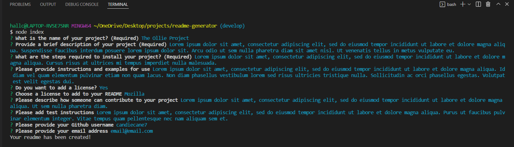

# readme-generator

## Purpose
To create a readme.md generator that can be used for various projects.

## Usage
In the command line, run node index.js in the root folder of your project and follow the prompts. Once completed, you will have a readme generated!
*Important note - make sure you have a 'dist' folder in the root of your project for the readme to generate into

## Collaborators
Shout out to a couple website that really helped me with this project:
-[Stack Overflow](https://stackoverflow.com/questions/18244417/how-do-i-create-some-kind-of-table-of-content-in-github-wiki)
This particular question and answer helped me figure out how the syntax for a table of contents
-[W3Schools](https://www.w3schools.io/file/markdown-links/)
W3Schools always has great information, this time they helped with syntax for email
-[Lukas-h](https://gist.github.com/lukas-h/2a5d00690736b4c3a7ba)
Shout-out to this person for listing all of the license and badge information I needed!

## User Story
AS A developer
I WANT a README generator
SO THAT I can quickly create a professional README for a new project

## Acceptance Criteria
GIVEN a command-line application that accepts user input
WHEN I am prompted for information about my application repository
THEN a high-quality, professional README.md is generated with the title of my project and sections entitled Description, Table of Contents, Installation, Usage, License, Contributing, Tests, and Questions
WHEN I enter my project title
THEN this is displayed as the title of the README
WHEN I enter a description, installation instructions, usage information, contribution guidelines, and test instructions
THEN this information is added to the sections of the README entitled Description, Installation, Usage, Contributing, and Tests
WHEN I choose a license for my application from a list of options
THEN a badge for that license is added near the top of the README and a notice is added to the section of the README entitled License that explains which license the application is covered under
WHEN I enter my GitHub username
THEN this is added to the section of the README entitled Questions, with a link to my GitHub profile
WHEN I enter my email address
THEN this is added to the section of the README entitled Questions, with instructions on how to reach me with additional questions
WHEN I click on the links in the Table of Contents
THEN I am taken to the corresponding section of the README

## Built With
Javascript, Node.js, Inquirer

## Screenshot

